# DLHD
[](https://travis-ci.com/gaurav-chaurasia/IT254-PROJECT) [](http://nodejs.org/download/) [](https://github.com/gaurav-chaurasia/IT254-PROJECT/issues)   


> Note: All steps were performed using on Windows 10.  
> [website](#)

- [INSTALLATIONS](#INSTALLATIONS)
- [RUN LOCALLY](#RUN_LOCALLY) 
- [SS]()
  - [HOME](#HOME)
  - [AUTH](#AUTH)
  - [MEDS ans DISEASE INFO](#MEDS_ans_DISEASE_INFO)
  - [MSG LIVECHAT](#MSG_LIVECHAT)
  - [CONTAGIOUS DISEASE TRACKER](#CONTAGIOUS_DISEASE_TRACKER)


### INSTALLATIONS   
- Install `node(14.15.0)` 
  - [NODEJS](https://nodejs.org/en/)
  - Use default setting and just keep clicling `next` till finish
- Install `Git` 
  -[GIT](https://git-scm.com/)
  - Use default setting and just keep clicling `next` till finish
- done installations!!!


### RUN_LOCALLY   
- Clone the Repo:

```
        $ git clone https://github.com/gaurav-chaurasia/IT254-PROJECT.git
```

- Move to the folder where you cloned the project 
- Install all dependencies and devDependencies by running the following command

```
        $ npm install
```

- Before running the server add `.env` file in root folder or simply replace `.env.example` with `.env` file and add your keys
- to get Client id & Client Secret [link](https://www.balbooa.com/gridbox-documentation/how-to-get-google-client-id-and-client-secret)
- to get `DATABASE_CONNECTION_URL` and make DB connection [link](https://medium.com/@sergio13prez/connecting-to-mongodb-atlas-d1381f184369)

```js
        # database connection url
        DATABASE_URI=<YOUR_DATABASE_CONNECTION_URL>

        # client id & secret for OAuth
        GOOGLE_OAUTH2_CLIENT_ID=<YOUR_OAUTH_CLIENT_ID>
        GOOGLE_OAUTH2_CLIENT_SECRET=<YOUR_OAUTH_CLIENT_SECRET>
```   

- Now run the server by running following command
  - dev runs the sever with nodemon which automatically restart server everytime we make any changes  

```js
    $ npm start
```

- The above steps starts the development server on localhost:3000 
- Go to `http://localhost:3000/` in your browser 
- It will automatically redirect you to the Home page and then ask for Signup or Login.


### List of features

- [x] seperate dashboard for diff users roles like normal, admin and doctor roles
- [x] This user can check any medicine, disease details entered by authorized DOCTORS
- [x] Users can search for any medicine or disease
- [x] Users can search for medicine by its name or the disease name for which any medicine is used.
- [x] Proper authentication is present to keep data safe and secure.
- [x] Third-party authentication is also present (OAuth2.0).
    - [x] Google OAuth2.0 implimented
    - [x] Facebook 
    - [x] GitHub
- [x] Users can see other users nearby with symptoms of any contagious disease.
- [x] Users can perform CRUD on geospatial data. (create, read, delete, update)
- [x] Live chat with doctor
    - [x] use web socket 
    - [ ] doctor can prescrib medicine
    - [ ] perscribtion sent to mail
    - [ ] user gets notification when doctors replies 
- [x] Capability to pay and buy prescribed medicines
    - [ ] pay using paypal
    - [ ] pay using stripe


### `SCREENSHOTS`  
>
> ##### `HOME` 
>
> 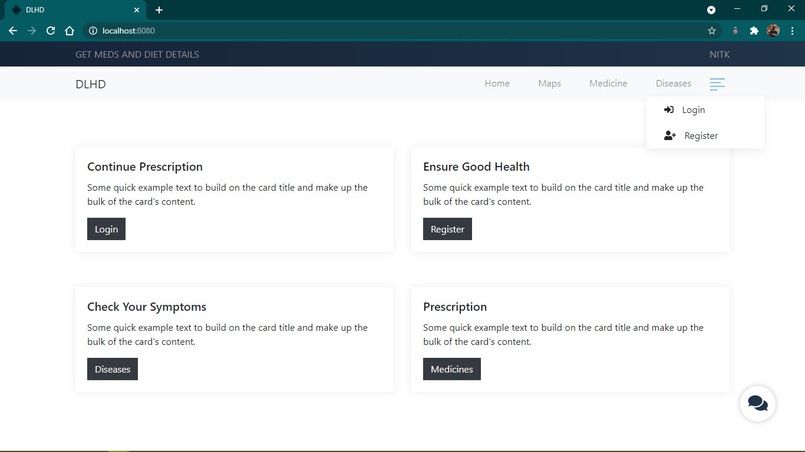
>
> 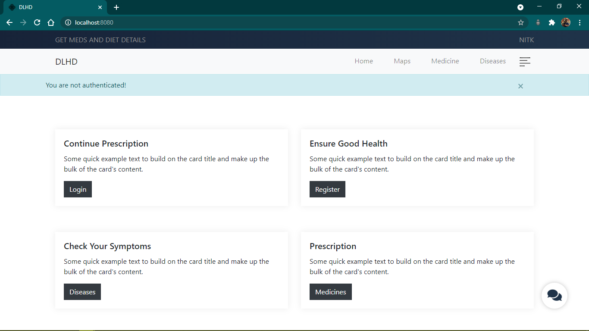
>
> 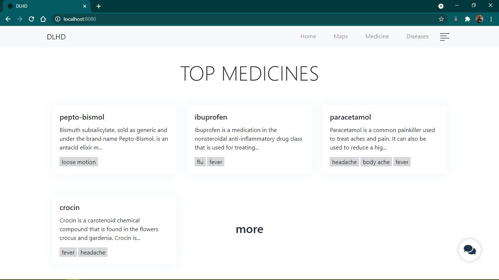
>
> 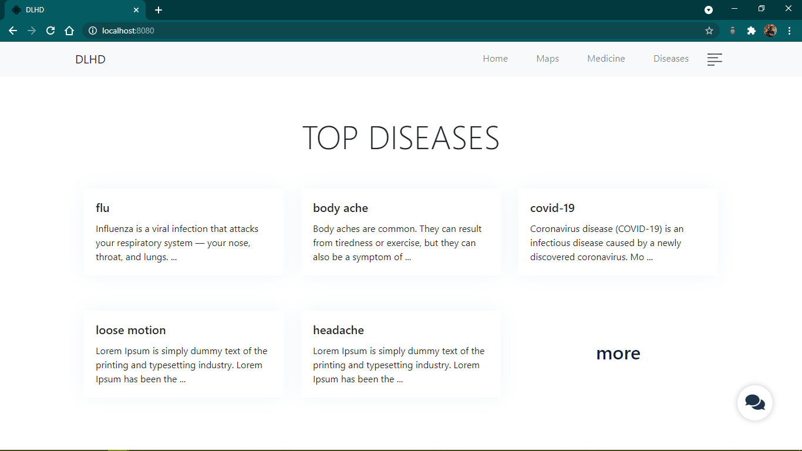
>
> ##### `AUTH`
>
> 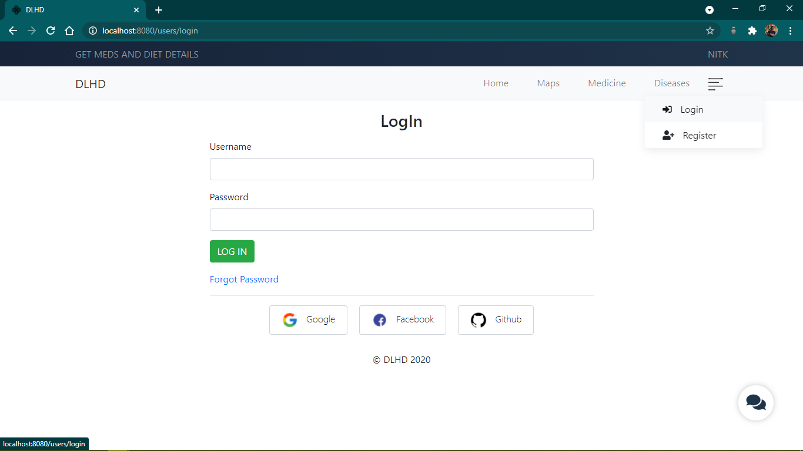
>
> 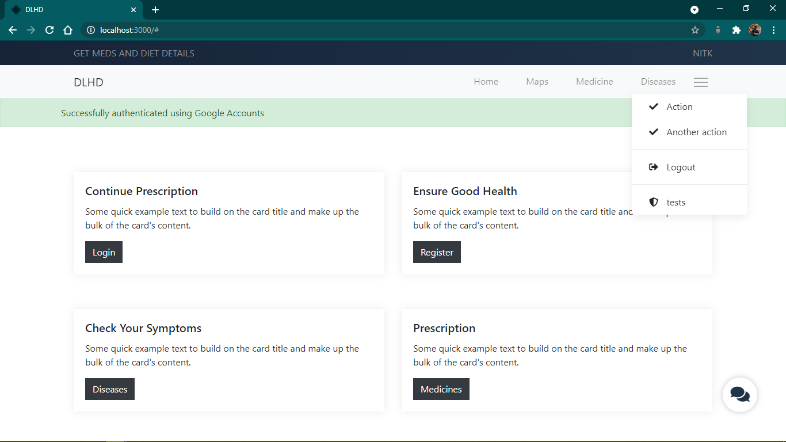
>
> ##### `MEDS_and_DISEASE_INFO`
>
> 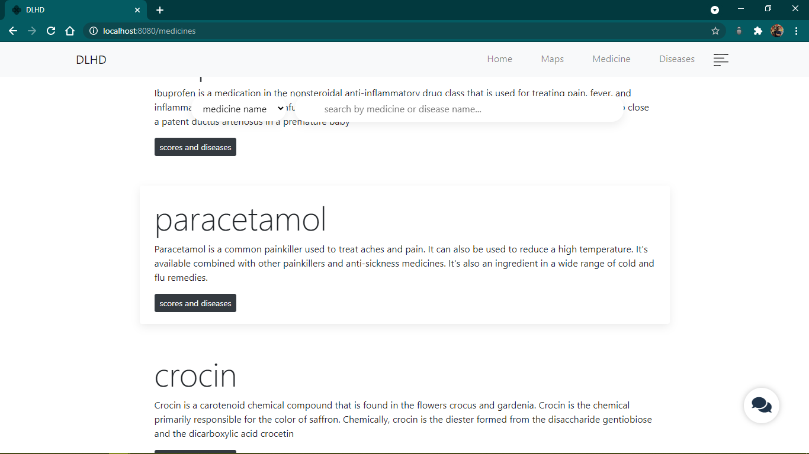
>
> 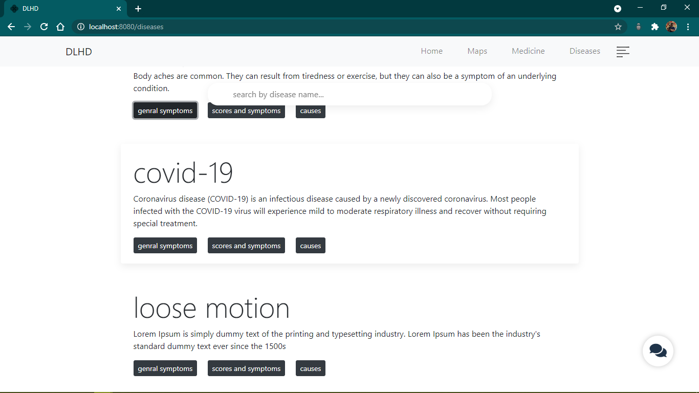
> 
>  ##### `MSG_LIVECHAT`
>
> 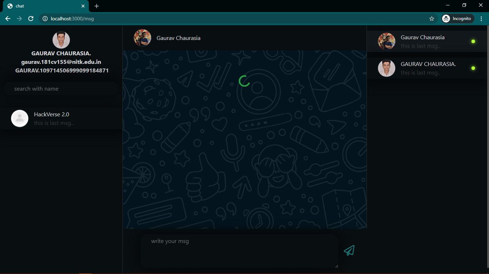
>
> 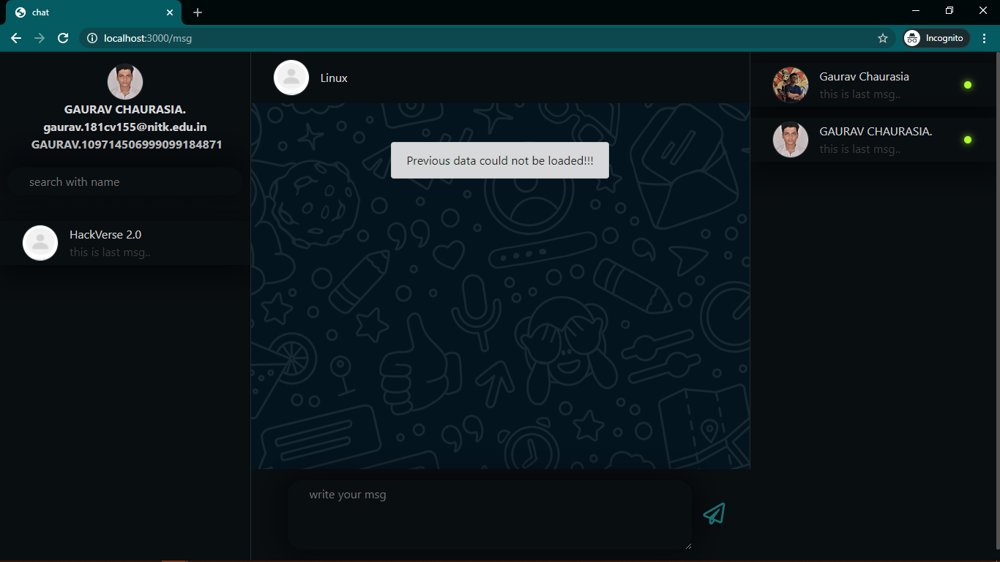
>
> 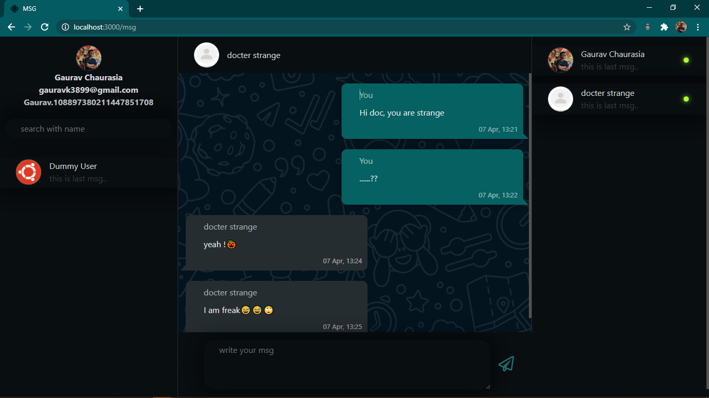
>
> ##### `CONTAGIOUS_DISEASE_TRACKER`
>
> 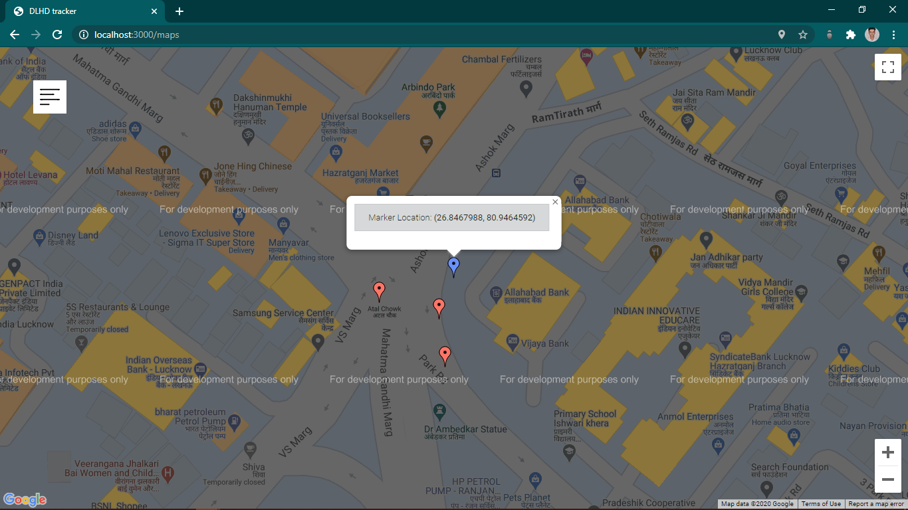
>
> 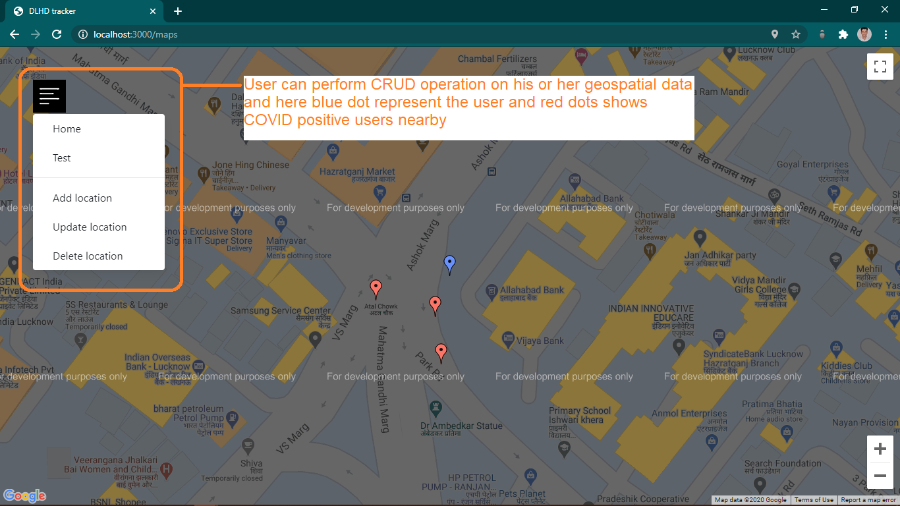
>

- [SS WITH EXPLANATION]()
  - [HOME](docs/home.md)
  - [LOGIN](docs/auth.md)
  - [DOCTOR](docs/doctor.md)
  - [MEDS and DISEASE INFO](docs/med_dis.md)
  - [CONTAGIOUS DISEASE TRACKER](docs/tracker.md)
  - [MSG LIVECHAT](docs/msg.md)
